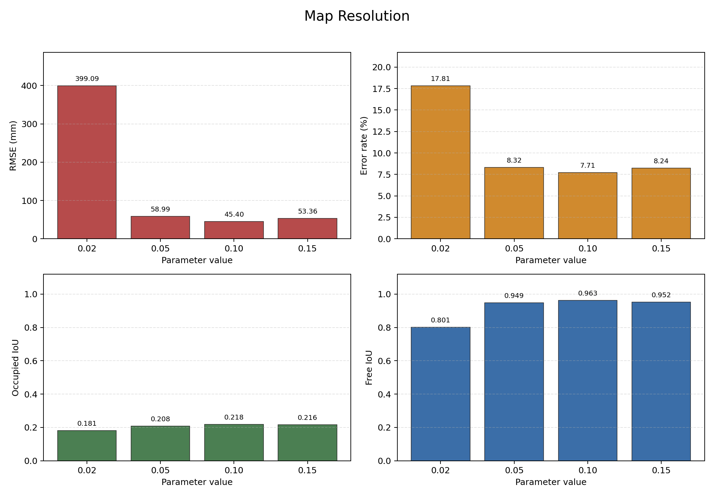

# SLAM Toolbox Map Evaluation

Reference map: `maps/house_scan_ground_truth.yaml`

| Study | Value | Map | RMSE (mm) | Error (%) | Occupied IoU | Free IoU | False occupied | Missed occupied |
|---|---:|---|---:|---:|---:|---:|---:|---:|
| minimum_travel_distance | 0.05 | `house_mtd_005` | 43.88 | 9.19 | 0.217 | 0.961 | 1694 | 3740 |
| minimum_travel_distance | 0.10 | `house_mtd_010` | 57.96 | 10.08 | 0.198 | 0.948 | 1854 | 3835 |
| minimum_travel_distance | 0.30 | `house_mtd_030` | 72.37 | 10.52 | 0.190 | 0.938 | 1871 | 3887 |
| minimum_travel_distance | 0.60 | `house_mtd_060` | 82.34 | 11.00 | 0.189 | 0.928 | 2361 | 3803 |
| minimum_travel_heading | 0.05 | `house_mth_005` | 43.91 | 9.00 | 0.230 | 0.960 | 1640 | 3656 |
| minimum_travel_heading | 0.10 | `house_mth_010` | 47.61 | 9.25 | 0.229 | 0.957 | 1723 | 3650 |
| minimum_travel_heading | 0.30 | `house_mth_030` | 57.89 | 9.63 | 0.216 | 0.949 | 1689 | 3744 |
| minimum_travel_heading | 0.60 | `house_mth_060` | 64.37 | 10.08 | 0.196 | 0.945 | 1755 | 3870 |
| resolution | 0.02 | `house_res_002` | 399.09 | 17.81 | 0.181 | 0.801 | 3751 | 3610 |
| resolution | 0.05 | `house_res_005` | 58.99 | 8.32 | 0.208 | 0.949 | 1825 | 3770 |
| resolution | 0.10 | `house_res_010` | 45.40 | 7.71 | 0.218 | 0.963 | 1609 | 3748 |
| resolution | 0.15 | `house_res_015` | 53.36 | 8.24 | 0.216 | 0.952 | 1851 | 3713 |
| do_loop_closing | true | `house_loop_on` | 57.96 | 6.87 | 0.198 | 0.948 | 1854 | 3835 |
| do_loop_closing | false | `house_loop_off` | 1187.23 | 40.92 | 0.047 | 0.499 | 5643 | 4730 |

## Resolution Study

Tham so `resolution` quy dinh kich thuoc thuc te cua mot o luoi tren ban do occupancy grid. De danh gia anh huong cua tham so nay, thuat toan `slam_toolbox` duoc khao sat voi cac gia tri `0.02 m`, `0.05 m`, `0.10 m` va `0.15 m`. Cac ban do thu duoc duoc so sanh voi ban do chuan `house_scan_ground_truth` thong qua RMSE, Error rate va IoU.

Tu bieu do co the thay `resolution = 0.02 m` cho sai so lon nhat do ban do qua nhay voi nhieu cam bien va sai so dinh vi. Khi tang `resolution` len `0.05 m` va `0.10 m`, ban do on dinh hon, RMSE giam ro ret. Trong cac truong hop khao sat, `resolution = 0.10 m` cho RMSE nho nhat, the hien su can bang tot giua do chi tiet va do on dinh cua ban do.

Notes:
- `RMSE` is computed from the symmetric nearest occupied-boundary distance.
- `Occupied IoU` measures obstacle overlap with the reference map.
- `Free IoU` measures free-space overlap with the reference map.
- `False occupied` means the SLAM map adds obstacle pixels not present in the reference.
- `Missed occupied` means obstacle pixels in the reference are missing from the SLAM map.
